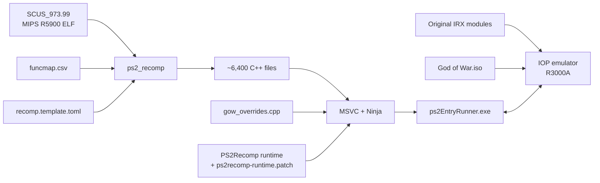

<div align="center">

# God of War — PS2 Static Recompilation

**English** · [Español](README.es.md) · [Português (Brasil)](README.pt-BR.md)

**A native PC port of *God of War* (PS2, NTSC-U `SCUS-97399`) built by statically recompiling MIPS R5900 code to C++.**


</div>

---

> [!IMPORTANT]
> This repository **does not contain any game files** (ISO, executable, IRX modules or `.PAK` data),
> nor the C++ code generated from them. You need **your own legal copy** of God of War for the PS2.

## Contents

- [What is this?](#what-is-this)
- [Current status](#current-status)
- [Repository layout](#repository-layout)
- [Requirements](#requirements)
- [Building and running](#building-and-running)
- [How it works](#how-it-works)
- [Documentation](#documentation)
- [Credits and license](#credits-and-license)

## What is this?

Instead of emulating the PlayStation 2 one instruction at a time, this project **translates the game's
original executable (`SCUS_973.99`) into C++** with [PS2Recomp](https://github.com/ran-j/PS2Recomp) and
compiles it as a native Windows program, linked against a runtime that reimplements the PS2 hardware and
operating system (EE kernel, GS, DMA, CD/DVD…). The I/O processor (IOP) runs the game's **original IRX
modules** (sound driver, data streamer…) on PS2Recomp's R3000A interpreter.

This repository holds everything that is specific to God of War:

| Component | Description |
|---|---|
| **Function map** | 6,414 functions identified in the ELF (`config/funcmap.csv`) |
| **Recompiler configuration** | Stubs, entry points (including vtable-only virtual methods) and instruction patches (`config/recomp.template.toml`) |
| **Game overrides** | Hand-written replacements and diagnostics for game functions (`src/gow_overrides.cpp`) |
| **Runtime patch** | Fixes to PS2Recomp's IOP emulator and EE runtime needed by this game (`patches/`) |
| **Build scripts** | A complete, reproducible Windows pipeline (`scripts/`) |
| **Tools** | DVD-9 layer 1 extractor (`tools/`) |

## Current status

<a href="docs/estado/detalle.en.md"></a>

Per-library and per-component breakdown: [`docs/estado/detalle.en.md`](docs/estado/detalle.en.md). Regenerated from `docs/estado/datos.toml` by `tools/estado/generar.py` (and automatically on push to `main`).

| Milestone | Status |
|---|:---:|
| Extracting both layers of the DVD-9 | ✅ |
| Recompiling `SCUS_973.99` to C++ (6,418 files) | ✅ |
| Building the native executable (MSVC, x64) | ✅ |
| Boot: raylib/OpenGL, heap and thread initialization | ✅ |
| The game's original IRX modules on the IOP emulator (`989snd`, `smpd`, `libsd`…) | ✅ |
| Streaming data from the original ISO (`smpd` → `R_PERM.WAD`, game configuration) | ✅ |
| Main game loop (`sys::GameLoop`) | ✅ |
| Video output: legal screen and title logo | ✅ |
| Correct text/font rendering | 🔧 in progress |
| Audio, controller and memory card | ⏳ pending |

The game boots, runs the original IOP modules (including the `smpd` data streamer), streams its data from
the ISO, enters its main loop and **renders its first screens**: the *"Sony Computer Entertainment America
presents"* legal screen and the *God of War* title logo. Some text glyphs are still missing, and the game
asks for a DualShock 2 because the controller (SIO2) is not emulated yet. See
[`docs/ESTADO.md`](docs/ESTADO.md) for the detailed investigation log.

## Repository layout

```
.
├── config/
│   ├── funcmap.csv               # Function map (name, start, end, size)
│   └── recomp.template.toml      # PS2Recomp configuration (@ELF@, @MAP@, @OUT@)
├── docs/                         # Technical documentation (Spanish)
│   └── estado/                   # Status map data and generated SVG/tables
├── game/                         # YOUR SCUS_973.99 goes here (ignored by git)
├── patches/
│   └── ps2recomp-runtime.patch   # Changes on top of PS2Recomp @ c5a9d02
├── scripts/
│   ├── 1_instalar_herramientas.cmd  # Install the tools
│   ├── 2_compilar.cmd               # Full build pipeline
│   ├── 2_recompilar_rapido.cmd      # Rebuild only src/gow_overrides.cpp (~1 min)
│   ├── 3_ejecutar.cmd               # Run for 60 s and keep the logs
│   ├── 3_ejecutar_manual.cmd        # Run with no time limit
│   ├── monitor.cmd                  # Monitor CPU/RAM while building
│   └── *.ps1                        # Script logic
├── src/
│   └── gow_overrides.cpp         # Game-specific overrides
└── tools/
    ├── extraer_capa2.ps1         # Extracts layer 1 of a PS2 DVD-9 ISO
    └── estado/generar.py         # Status map generator
```

> Script and folder names are in Spanish, the project's original language.

## Requirements

- Windows 10/11 x64
- [Visual Studio 2022 Build Tools](https://visualstudio.microsoft.com/downloads/) with the **C++** workload (includes CMake and Ninja)
- [Git](https://git-scm.com/)
- ~10 GB of free space; 16 GB of RAM recommended (the build uses every core)
- Your own copy of **God of War (NTSC-U, SCUS-97399)**

`scripts\1_instalar_herramientas.cmd` installs Git and the Build Tools with `winget`.

## Building and running

**1. Get the game files.** Copy the executable from your disc/ISO to `game\SCUS_973.99`
(or point the `GOW_ELF` environment variable at it).

Place the disc's **`.IRX` modules** (`SMPD_IOP.IRX`, `989NOMID.IRX`, `LIBSD.IRX`…) next to the ELF: the IOP
emulator runs the originals, and `scripts\ejecutar.ps1` copies them into `IOP_MOD\` on first run.
Reading the game data requires the **original ISO**: name it `God of War.iso` and put it in the folder
above the ELF's folder, or set the `GOW_ISO` environment variable to its path.

To also extract the data on the second layer of the DVD:

```powershell
powershell -ExecutionPolicy Bypass -File tools\extraer_capa2.ps1 -Iso "D:\God of War.iso" -Salida "D:\GOW ISO extraida"
```

**2. Install the tools** (first time only):

```bat
scripts\1_instalar_herramientas.cmd
```

**3. Build** (20–40 min the first time):

```bat
scripts\2_compilar.cmd
```

The script clones PS2Recomp into `<drive>:\gowport` (a short path to avoid the 260-character limit;
configurable with `GOW_WORK`), pins commit `c5a9d02`, applies the patch, generates the C++ code and builds
`ps2EntryRunner.exe`. The log is written to `logs\2_compilar.log`.

**4. Run:**

```bat
scripts\3_ejecutar.cmd          :: 60 seconds, output in logs\
scripts\3_ejecutar_manual.cmd   :: no time limit
```

## How it works



More details in [`docs/ARQUITECTURA.md`](docs/ARQUITECTURA.md).

## Documentation

The technical documentation is currently written in Spanish:

- [`docs/ARQUITECTURA.md`](docs/ARQUITECTURA.md) — pipeline, overrides and runtime patch
- [`docs/ESTADO.md`](docs/ESTADO.md) — current status, investigation log, known issues and next steps

## Credits and license

- [**PS2Recomp**](https://github.com/ran-j/PS2Recomp) by ran-j and contributors — recompiler and runtime (GPL-3.0).
- *God of War* © Sony Interactive Entertainment / Santa Monica Studio. This project is not affiliated with
  or endorsed by Sony. No game content is distributed.

The code in this repository is released under the **GPL-3.0** license, consistent with PS2Recomp.
See [`LICENSE`](LICENSE).
