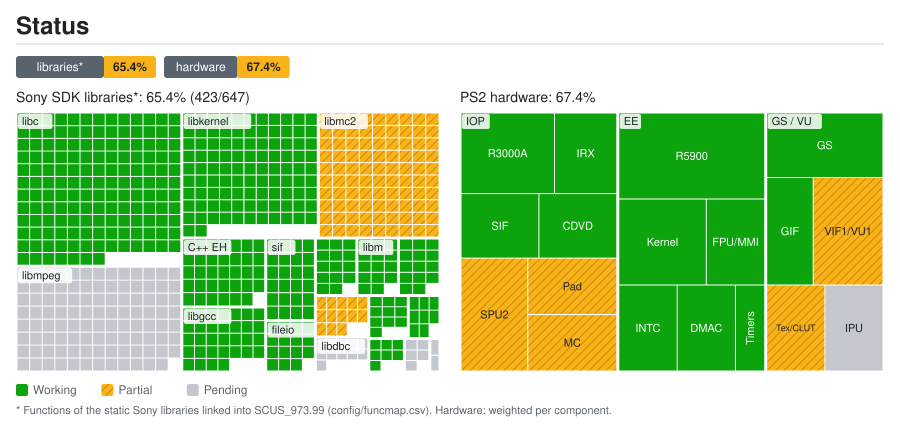

# Port status: details

Generated by `tools/estado/generar.py` from `docs/estado/datos.toml` and `config/funcmap.csv`. Do not edit by hand.

## Sony SDK libraries*: 65.4% (423/647)

| Library | Functions | Status | Note |
|---|---:|---|---|
| `libmpeg` | 103 | ⏳ Pending | FMV video: sceMpeg* are stubs |
| `libipu` | 5 | ⏳ Pending | FMV video: sceIpu* are stubs |
| `libgraph` | 7 | ✅ Working |  |
| `libdma` | 8 | ✅ Working |  |
| `libcdvd` | 10 | ✅ Working | Reads the original ISO |
| `libdbc` | 11 | ⏳ Pending | SIO2 not emulated |
| `libpad2` | 13 | ⏳ Pending | Controller: SIO2 not emulated |
| `libvib` | 2 | ⏳ Pending | Vibration: SIO2 not emulated |
| `libmc2` | 90 | ⏳ Pending | Memory card: SIO2 not emulated |
| `libscf` | 14 | ✅ Working |  |
| `libgcc` | 32 | ✅ Working |  |
| `C++ EH` | 34 | ✅ Working |  |
| `libm` | 14 | ✅ Working |  |
| `libc` | 150 | ✅ Working |  |
| `libkernel` | 101 | ✅ Working |  |
| `sif` | 24 | ✅ Working | SIF commands and RPC |
| `fileio` | 15 | ✅ Working |  |
| `loadfile` | 14 | ✅ Working | IOP heap and module loading |

## PS2 hardware: 67.4%

| Group | Component | Weight | Status | Note |
|---|---|---:|---|---|
| EE | R5900 CPU (recompiled to C++) | 5 | ✅ Working |  |
| EE | Kernel: threads, semaphores and alarms | 3 | ✅ Working |  |
| EE | FPU (COP1) and MMI instructions | 2 | ✅ Working |  |
| EE | INTC: VSync and GS interrupt | 2 | ✅ Working |  |
| EE | DMA controller | 2 | ✅ Working |  |
| EE | Timers | 1 | ✅ Working |  |
| GS / VU | GS: primitives and framebuffer | 3 | ✅ Working |  |
| GS / VU | VIF1 and VU1 | 3 | 🔧 Partial | Not verified beyond the first screens |
| GS / VU | GS: textures, CLUT and fonts | 2 | 🔧 Partial | Some text glyphs are missing |
| GS / VU | GIF (PATH1-3) | 2 | ✅ Working |  |
| GS / VU | IPU: FMV video | 2 | ⏳ Pending |  |
| IOP | R3000A CPU (interpreter) | 3 | ✅ Working |  |
| IOP | SPU2: audio output | 3 | ⏳ Pending | 989snd runs, but there is no SPU2 output |
| IOP | Original IRX modules | 2 | ✅ Working |  |
| IOP | SIF: EE ↔ IOP RPC and DMA | 2 | ✅ Working |  |
| IOP | CDVD: reading the original ISO | 2 | ✅ Working |  |
| IOP | SIO2: DualShock 2 controller | 2 | ⏳ Pending |  |
| IOP | SIO2: memory card | 2 | ⏳ Pending |  |

* Functions of the static Sony libraries linked into SCUS_973.99 (config/funcmap.csv). Hardware: weighted per component.
