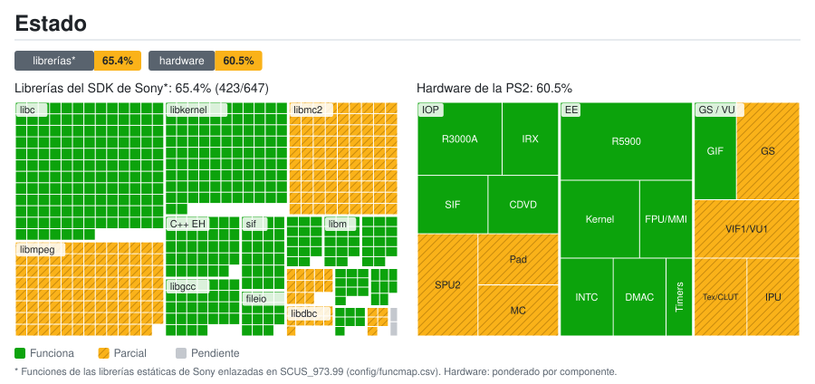

# Estado del port: detalle

Generado por `tools/estado/generar.py` a partir de `docs/estado/datos.toml` y `config/funcmap.csv`. No lo edites a mano.

## Librerías del SDK de Sony*: 65.4% (423/647)

| Librería | Funciones | Estado | Nota |
|---|---:|---|---|
| `libmpeg` | 103 | ⏳ Pendiente | Vídeo FMV: sceMpeg* son stubs |
| `libipu` | 5 | ⏳ Pendiente | sceIpuInit corregido (gowIpuInit); el FMV aún no se decodifica |
| `libgraph` | 7 | ✅ Funciona |  |
| `libdma` | 8 | ✅ Funciona |  |
| `libcdvd` | 10 | ✅ Funciona | Lee la ISO original |
| `libdbc` | 11 | ⏳ Pendiente | SIO2 sin emular |
| `libpad2` | 13 | 🔧 Parcial | HLE del primer puerto (teclado o gamepad); presiones 0/255 |
| `libvib` | 2 | ⏳ Pendiente | Sin vibración: el HLE no anuncia actuadores |
| `libmc2` | 90 | ⏳ Pendiente | Memory card: SIO2 sin emular |
| `libscf` | 14 | ✅ Funciona |  |
| `libgcc` | 32 | ✅ Funciona |  |
| `C++ EH` | 34 | ✅ Funciona |  |
| `libm` | 14 | ✅ Funciona |  |
| `libc` | 150 | ✅ Funciona |  |
| `libkernel` | 101 | ✅ Funciona |  |
| `sif` | 24 | ✅ Funciona | Comandos y RPC del SIF |
| `fileio` | 15 | ✅ Funciona |  |
| `loadfile` | 14 | ✅ Funciona | Heap del IOP y carga de módulos |

## Hardware de la PS2: 67.4%

| Grupo | Componente | Peso | Estado | Nota |
|---|---|---:|---|---|
| EE | CPU R5900 (recompilada a C++) | 5 | ✅ Funciona |  |
| EE | Kernel: hilos, semáforos y alarmas | 3 | ✅ Funciona |  |
| EE | FPU (COP1) e instrucciones MMI | 2 | ✅ Funciona |  |
| EE | INTC: VSync e interrupción del GS | 2 | ✅ Funciona |  |
| EE | Controlador DMA | 2 | ✅ Funciona |  |
| EE | Temporizadores | 1 | ✅ Funciona |  |
| GS / VU | GS: primitivas y framebuffer | 3 | ✅ Funciona |  |
| GS / VU | VIF1 y VU1 | 3 | 🔧 Parcial | Sin rechazos de XGKICK desde ps2recomp-vu-jump.patch, pero la partida sigue en negro: no se ve escena 3D |
| GS / VU | GS: texturas, CLUT y fuentes | 2 | 🔧 Parcial | Faltan letras en algunos textos |
| GS / VU | GIF (PATH1-3) | 2 | ✅ Funciona |  |
| GS / VU | IPU: vídeo FMV | 2 | ⏳ Pendiente | Se alcanza la carga del FMV, pero se queda esperando a MPEG |
| IOP | CPU R3000A (intérprete) | 3 | ✅ Funciona |  |
| IOP | SPU2: salida de audio | 3 | ⏳ Pendiente | 989snd corre, pero no hay salida de SPU2 |
| IOP | Módulos IRX originales | 2 | ✅ Funciona |  |
| IOP | SIF: RPC y DMA EE ↔ IOP | 2 | ✅ Funciona |  |
| IOP | CDVD: lectura de la ISO original | 2 | ✅ Funciona |  |
| IOP | Mando DualShock 2 | 2 | 🔧 Parcial | libpad2 por HLE (primer puerto); el bus SIO2 sigue sin emular |
| IOP | SIO2: memory card | 2 | ⏳ Pendiente |  |

* Funciones de las librerías estáticas de Sony enlazadas en SCUS_973.99 (config/funcmap.csv). Hardware: ponderado por componente.
