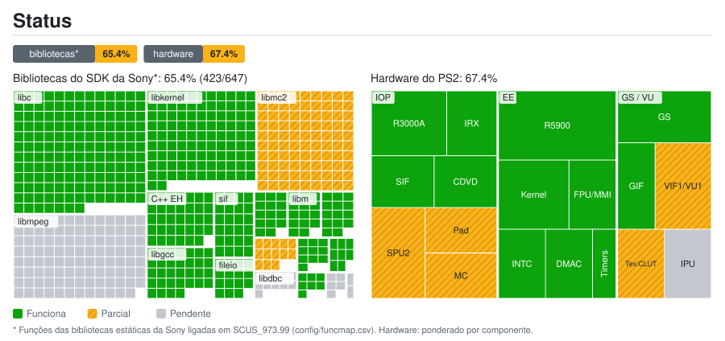

# Status do port: detalhes

Gerado por `tools/estado/generar.py` a partir de `docs/estado/datos.toml` e `config/funcmap.csv`. Não edite à mão.

## Bibliotecas do SDK da Sony*: 65.4% (423/647)

| Biblioteca | Funções | Status | Nota |
|---|---:|---|---|
| `libmpeg` | 103 | ⏳ Pendente | Vídeo FMV: sceMpeg* são stubs |
| `libipu` | 5 | ⏳ Pendente | Vídeo FMV: sceIpu* são stubs |
| `libgraph` | 7 | ✅ Funciona |  |
| `libdma` | 8 | ✅ Funciona |  |
| `libcdvd` | 10 | ✅ Funciona | Lê a ISO original |
| `libdbc` | 11 | ⏳ Pendente | SIO2 não emulado |
| `libpad2` | 13 | ⏳ Pendente | Controle: SIO2 não emulado |
| `libvib` | 2 | ⏳ Pendente | Vibração: SIO2 não emulado |
| `libmc2` | 90 | ⏳ Pendente | Memory card: SIO2 não emulado |
| `libscf` | 14 | ✅ Funciona |  |
| `libgcc` | 32 | ✅ Funciona |  |
| `C++ EH` | 34 | ✅ Funciona |  |
| `libm` | 14 | ✅ Funciona |  |
| `libc` | 150 | ✅ Funciona |  |
| `libkernel` | 101 | ✅ Funciona |  |
| `sif` | 24 | ✅ Funciona | Comandos e RPC do SIF |
| `fileio` | 15 | ✅ Funciona |  |
| `loadfile` | 14 | ✅ Funciona | Heap do IOP e carga de módulos |

## Hardware do PS2: 67.4%

| Grupo | Componente | Peso | Status | Nota |
|---|---|---:|---|---|
| EE | CPU R5900 (recompilada para C++) | 5 | ✅ Funciona |  |
| EE | Kernel: threads, semáforos e alarmes | 3 | ✅ Funciona |  |
| EE | FPU (COP1) e instruções MMI | 2 | ✅ Funciona |  |
| EE | INTC: VSync e interrupção do GS | 2 | ✅ Funciona |  |
| EE | Controlador DMA | 2 | ✅ Funciona |  |
| EE | Temporizadores | 1 | ✅ Funciona |  |
| GS / VU | GS: primitivas e framebuffer | 3 | ✅ Funciona |  |
| GS / VU | VIF1 e VU1 | 3 | 🔧 Parcial | Não verificado além das primeiras telas |
| GS / VU | GS: texturas, CLUT e fontes | 2 | 🔧 Parcial | Faltam letras em alguns textos |
| GS / VU | GIF (PATH1-3) | 2 | ✅ Funciona |  |
| GS / VU | IPU: vídeo FMV | 2 | ⏳ Pendente |  |
| IOP | CPU R3000A (interpretador) | 3 | ✅ Funciona |  |
| IOP | SPU2: saída de áudio | 3 | ⏳ Pendente | 989snd roda, mas não há saída de SPU2 |
| IOP | Módulos IRX originais | 2 | ✅ Funciona |  |
| IOP | SIF: RPC e DMA EE ↔ IOP | 2 | ✅ Funciona |  |
| IOP | CDVD: leitura da ISO original | 2 | ✅ Funciona |  |
| IOP | SIO2: controle DualShock 2 | 2 | ⏳ Pendente |  |
| IOP | SIO2: memory card | 2 | ⏳ Pendente |  |

* Funções das bibliotecas estáticas da Sony ligadas em SCUS_973.99 (config/funcmap.csv). Hardware: ponderado por componente.
